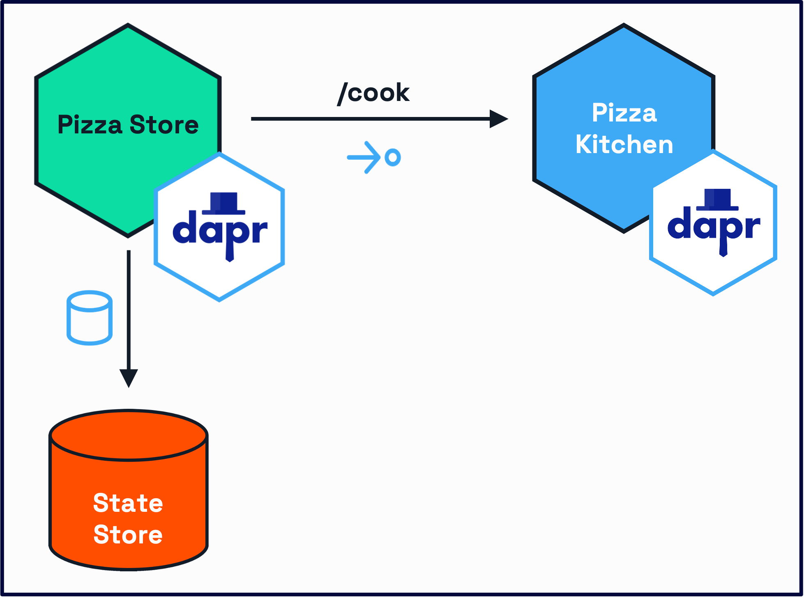
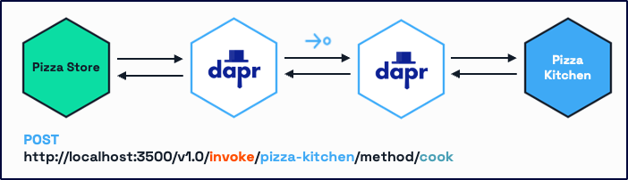

# Challenge 2 - Service Invocation

## Overview

In this challenge, you will create three services that will change the status of your order via service invocations. For that, you will:

- Create a new service called `pizza-storefront` with a `/order` endpoint.
- Create a new service called `pizza-kitchen` with a `/cook` endpoint.
- Create a new service called `pizza-delivery` with a `/delivery` endpoint.
- Use Dapr's Service Invocation API to call the `/cook` and `/deliver` endpoints from the `pizza-storefront` app.



To learn more about the Dapr Service Invocation building block, refer to the [Dapr docs](https://docs.dapr.io/developing-applications/building-blocks/service-invocation/).

### Install the dependencies

Navigate to the root of your project. Before you start coding, install the dependencies:

```bash
```bash
# Create virtual environment
python3 -m venv env
source env/bin/activate

# Navigate to the service folder and add the Dapr package
cd pizza-storefront
pip install -r requirements.txt

cd ..

cd pizza-kitchen
pip install -r requirements.txt

cd ..

cd pizza-delivery
pip install -r requirements.txt
```

## Create the service

Both files `/pizza-kitchen/app.py` and `/pizza-delivery/app.py` contain endpoints that we will invoke from the `pizza-storefront` service.

1. Navigate to the `/pizza-storefront` service folder. Open `app.py` and import the Dapr Client.

```python
from dapr.clients import DaprClient
```

## Create the app route

Modify the method `process_order`, by replacing `# TODO: Add Service invocation code` with the code below, making sure the proper spacing is maintained:

```python
# Call the pizza-kitchen service to cook the pizza
app_id = 'pizza-kitchen'
headers = {'dapr-app-id': app_id, 'content-type': 'application/json'}

base_url = 'http://localhost'
dapr_http_port = 3502
method = 'cook'
target_url = '%s:%s/%s' % (base_url, dapr_http_port, method)

response = requests.post(
    url=target_url,
    data=json.dumps(order_data),
    headers=headers
)
print('result: ' + response.text, flush=True)

# Call the pizza-delivery service to deliver the pizza
app_id = 'pizza-delivery'
headers = {'dapr-app-id': app_id, 'content-type': 'application/json'}

method = 'deliver'
target_url = '%s:%s/%s' % (base_url, dapr_http_port, method)

response = requests.post(
    url=target_url,
    data=json.dumps(order_data),
    headers=headers
)
print('result: ' + response.text, flush=True)
```

### Breaking down the code above

1. First the HTTP headers are defined:

```python
headers = {'dapr-app-id': app_id, 'content-type': 'application/json'}
```

The Dapr sidecar will use the information in the `dapr-app-id` to discover the location of the _pizza-kitchen_ app.

2. The `target_url` is created that will be invoked:

```python
target_url = '%s:%s/%s' % (base_url, dapr_http_port, method)
```

This starts with localhost, since the _pizza-storefront_ Dapr sidecar is running there, the port of this Dapr sidecar (`3502`), and the method that will be called (`cook`) on the _pizza-kitchen_ app. 

3. Finally the `requests.post` method is used to combine the `target_url`, `order_data` payload and the `headers`:

 ```python
 response = requests.post(
        url=target_url,
        data=json.dumps(order_data),
        headers=headers
```

This method will not invoke the `cook` method on the _pizza-kitchen_ application directly. The Dapr sidecar of the _pizza-storefront_ application makes a call to the Dapr sidecar of the _pizza-kitchen_ application. The responsiblity of making the service invocation call is then passed to the sidecar, as the picture below illustrates:



This way, services only need to communicate to their associated sidecar over localhost and the sidecar handles the service discovery and invocation capabilities.

The same process is applied to invoke the `/deliver` endpoint withing the `pizza-delivery` service.

## Run the applications

It's now time to run all three applications.

1. In your terminal, ensure you are in the `/pizza-storefront` folder and run the command below:

```bash
dapr run --app-id pizza-storefront --app-protocol http --app-port 8002 --dapr-http-port 3502  -- python3 app.py
```

2. Open a new terminal window and navigate to `/pizza-kitchen` folder. Run the command below:

```bash
dapr run --app-id pizza-kitchen --app-protocol http --app-port 8003 --dapr-http-port 3503  -- python3 app.py
```

3. Open a third terminal window and navigate to `/pizza-delivery` folder. Run the command below:

```bash
dapr run --app-id pizza-delivery --app-protocol http --app-port 8004 --dapr-http-port 3504  -- python3 app.py
```

> [!IMPORTANT]
> If you are using Consul as a naming resolution service, add `--config ../resources/config/config.yaml` before `-- python3 app.py` on your Dapr run command.

## Test the service

### Use VS Code REST Client

Open `Endpoints.http` and find the `Direct Pizza Store Endpoint (for testing)` endpoint call. Click on `Send request`.

Navigate to the `pizza-storefront` terminal, where you should see the following logs:

```zsh
== APP == INFO:__main__:Received new order: 123
== APP == INFO:__main__:Order 123 - validating
== APP == INFO:__main__:Order 123 - processing
== APP == INFO:__main__:Order 123 - confirmed
== APP == result: {"customer":{"address":"123 Main St","name":"John Doe","phone":"555-0123"},"order_id":"123","pizza_type":"pepperoni","size":"large","status":"cooked"}
== APP == 
== APP == result: {"customer":{"address":"123 Main St","name":"John Doe","phone":"555-0123"},"order_id":"123","pizza_type":"pepperoni","size":"large","status":"delivered"}
== APP == 
```

The logs for `pizza-kitchen` should read:

```zsh
== APP == INFO:__main__:Starting cooking for order: 123
== APP == INFO:__main__:Order 123 - preparing_ingredients
== APP == INFO:__main__:Order 123 - making_dough
== APP == INFO:__main__:Order 123 - adding_toppings
== APP == INFO:__main__:Order 123 - baking
== APP == INFO:__main__:Order 123 - quality_check
== APP == INFO:__main__:Order 123 - cooking completed
```

Finally, on `pizza-delivery`:

```zsh
== APP == INFO:__main__:Starting delivery for order: 123
== APP == INFO:__main__:Order 123 - finding_driver
== APP == INFO:__main__:Order 123 - driver_assigned
== APP == INFO:__main__:Order 123 - picked_up
== APP == INFO:__main__:Order 123 - on_the_way
== APP == INFO:__main__:Order 123 - arriving
== APP == INFO:__main__:Order 123 - at_location
== APP == INFO:__main__:Order 123 - delivery completed
```

### Use  _cURL_

### Use _cURL_

Alternatively, open a third terminal window and create a new order via cURL:

```bash
curl -H 'Content-Type: application/json' \
    -d '{ "orderId": "1", "pizzaType": "pepperoni", "size": "large", "customer": { "name": "John Doe", "address": "123 Main St", "phone": "555-0123" } }' \
    -X POST \
    http://localhost:8002/order
```

## Next Steps

Now that the services are updating the event information for every order step, you need to make sure that this information is being updated in the Redis state store. You will do this in the next challenge using Dapr [Pub/Sub](/docs/challenge-3/dotnet.md)!
