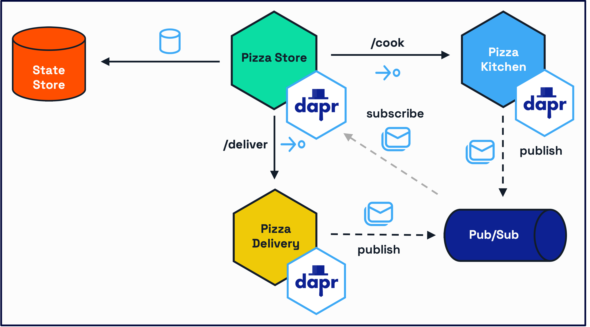

# Challenge 4 - Workflows

## Overview

On the fouth and final challenge, you will orchestrate the process of ordering, cooking, and delivering a pizza using Dapr Workflows. Dapr workflow makes it easy for developers to write business logic and integrations in a reliable way. Since Dapr workflows are stateful, they support long-running and fault-tolerant applications, ideal for orchestrating microservices.

You will:

- Replace the current chained service invocation calls that you created in the `pizza-storefront` service with a Workflow process.
- Add an external event to validate the quality of the pizza after the cooking proces is done.
- Query for the workflow status, pause, resume, and cancel the run.



To learn more about the Workflow building block, refer to the [Dapr docs](https://docs.dapr.io/developing-applications/building-blocks/workflow/).

## Import the required libraries

Navigate to the `challenge-4/PizzaWorkflow` folder and run the command below in a terminal:

```bash
dotnet add package Dapr.Workflow
```

## Modify the state store component to accept workflows

The Workflow building block requires a state store to manage its state during the run. You need to modify our `/resources/statestore.yaml` component to reflect that:

```yaml
apiVersion: dapr.io/v1alpha1
kind: Component
metadata:
  name: pizzastatestore
spec:
  type: state.redis
  version: v1
  metadata:
  - name: redisHost
    value: localhost:6379
  - name: redisPassword
    value: ""
  - name: actorStateStore
    value: "true"
scopes:
- pizza-workflow
- pizza-order
```

By setting the attribute `actorStateStore` value to `true` this state store component is able to manage Workflow data, since Workflows rely on [Dapr Actors](https://docs.dapr.io/developing-applications/building-blocks/workflow/workflow-features-concepts/#workflow-backend) in the background. You are also scoping the component to allow the `pizza-workflow` service to access it.

## Creating the Activities

Workflow activities are the basic unit of work in a workflow and are the tasks that get orchestrated in the business process. In this challenge, you will create a workflow to process a pizza order. The tasks will involve:

- Making a request to start the pizza order to the Storefront service.
- Invoking the Kitchen service to cook the pizza.
- Validating the pizza quality after it is cooked.
- Invoking the Delivery service to deliver the pizza.

Each task will be a separate activity. These activities will be executed in sequence since the order is imporant. Other [workflow patterns](https://docs.dapr.io/developing-applications/building-blocks/workflow/workflow-patterns/) can be used with Dapr Workflow, where activities are executed in parallel, or activities are called in a loop, but these are not relevant for this challenge.

### Create the Cooking Activity

Create an `Activities` folder inside the PizzaWorkflow folder. Inside this `/Activities` folder, create a new file called `CookingActivity.cs`. Copy and paste the following content:

```csharp
using Dapr.Client;
using Dapr.Workflow;
using PizzaWorkflow.Models;

namespace PizzaWorkflow.Activities;

public class CookingActivity : WorkflowActivity<Order, Order>
{
    private readonly DaprClient _daprClient;
    private readonly ILogger<CookingActivity> _logger;

    public CookingActivity(DaprClient daprClient, ILogger<CookingActivity> logger)
    {
        _daprClient = daprClient;
        _logger = logger;
    }

    public override async Task<Order> RunAsync(WorkflowActivityContext context, Order order)
    {
        try
        {
            _logger.LogInformation("Starting cooking process for order {OrderId}", order.OrderId);
            
            var response = await _daprClient.InvokeMethodAsync<Order, Order>(
                HttpMethod.Post,
                "pizza-kitchen",
                "cook",
                order);

            _logger.LogInformation("Order {OrderId} cooked with status {Status}", 
                order.OrderId, response.Status);
            
            return response;
        }
        catch (Exception ex)
        {
            _logger.LogError(ex, "Error cooking order {OrderId}", order.OrderId);
            throw;
        }
    }
}
```

#### Let's break this down

1. The section below imports the Dapr Client, Workflow, and the Order model you will leverage in this activity.

```csharp
using Dapr.Client;
using Dapr.Workflow;
using PizzaWorkflow.Models;
```

2. The `CookingActivity` is of type `WorkflowActivity` which has generic input and output type arguments. In this case, both the input and the output are of the same type, `Order`:

```csharp
public class CookingActivity : WorkflowActivity<Order, Order>
```

3. The `RunAsync` method runs as soon as we call the activity, as you will see in the next section.

```csharp
public override async Task<Order> RunAsync(WorkflowActivityContext context, Order order)
```

4. You are now using the Service Invocation API to invoke the `/cook` method from our `pizza-kitchen` service:

```csharp
var response = await _daprClient.InvokeMethodAsync<Order, Order>(
    HttpMethod.Post,
    "pizza-kitchen",
    "cook",
    order);
```

Now let's do the same to call the `pizza-delivery` and `pizza-storefront` applications via Activities.

### Create the Delivery Activity

Inside the `/Activities` folder, create a new file called `DeliveryActivity.cs`. Copy and paste the following content:

```csharp
using Dapr.Client;
using Dapr.Workflow;
using PizzaWorkflow.Models;

namespace PizzaWorkflow.Activities;

public class DeliveryActivity : WorkflowActivity<Order, Order>
{
    private readonly DaprClient _daprClient;
    private readonly ILogger<DeliveryActivity> _logger;

    public DeliveryActivity(DaprClient daprClient, ILogger<DeliveryActivity> logger)
    {
        _daprClient = daprClient;
        _logger = logger;
    }

    public override async Task<Order> RunAsync(WorkflowActivityContext context, Order order)
    {
        try
        {
            _logger.LogInformation("Starting delivery process for order {OrderId}", order.OrderId);
            
            var response = await _daprClient.InvokeMethodAsync<Order, Order>(
                HttpMethod.Post,
                "pizza-delivery",
                "delivery",
                order);

            _logger.LogInformation("Order {OrderId} delivered with status {Status}", 
                order.OrderId, response.Status);
            
            return response;
        }
        catch (Exception ex)
        {
            _logger.LogError(ex, "Error delivering order {OrderId}", order.OrderId);
            throw;
        }
    }
}
```

### Create the Storefront Activity

Inside the `/Activities` folder, create a new file called `StorefrontActivity.cs`. Copy and paste the following content:

```csharp
using Dapr.Client;
using Dapr.Workflow;
using PizzaWorkflow.Models;

namespace PizzaWorkflow.Activities;

public class StorefrontActivity : WorkflowActivity<Order, Order>
{
    private readonly DaprClient _daprClient;
    private readonly ILogger<StorefrontActivity> _logger;

    public StorefrontActivity(DaprClient daprClient, ILogger<StorefrontActivity> logger)
    {
        _daprClient = daprClient;
        _logger = logger;
    }

    public override async Task<Order> RunAsync(WorkflowActivityContext context, Order order)
    {
        try
        {
            _logger.LogInformation("Starting ordering process for order {OrderId}", order.OrderId);
            
            var response = await _daprClient.InvokeMethodAsync<Order, Order>(
                HttpMethod.Post,
                "pizza-storefront",
                "/storefront/order",
                order);

            _logger.LogInformation("Order {OrderId} processed with status {Status}", 
                order.OrderId, response.Status);
            
            return response;
        }
        catch (Exception ex)
        {
            _logger.LogError(ex, "Error processing order {OrderId}", order.OrderId);
            throw;
        }
    }
}
```

### Create the Validation Activity

The Validation Activity is a little different from the activities above. It will act as an external event that will allow or deny moving forward with the Workflow itself.

Inside the `/Activities` folder, create a new file called `ValidationActivity.cs`. Copy and paste the following content:

```csharp
using Dapr.Client;
using Dapr.Workflow;
using PizzaWorkflow.Models;

namespace PizzaWorkflow.Activities;

public class ValidationActivity : WorkflowActivity<Order, Order>
{
    private readonly DaprClient _daprClient;
    private readonly ILogger<ValidationActivity> _logger;

    public ValidationActivity(DaprClient daprClient, ILogger<ValidationActivity> logger)
    {
        _daprClient = daprClient;
        _logger = logger;
    }

    public override async Task<Order> RunAsync(WorkflowActivityContext context, Order order)
    {
        try
        {
            _logger.LogInformation("Starting validation process for order {OrderId}", order.OrderId);
            
            await _daprClient.SaveStateAsync(
                "pizzastatestore",
                $"validation_{order.OrderId}",
                new { order.OrderId, Status = "pending_validation" });

            _logger.LogInformation("Validation state saved for order {OrderId}", order.OrderId);
            
            return order;
        }
        catch (Exception ex)
        {
            _logger.LogError(ex, "Error in validation process for order {OrderId}", order.OrderId);
            throw;
        }
    }
}
```

As you can see, the code below saves a `pending_validation` status to our state store. This will define if the order should move to the delivery process or not as our workflow will wait for an external event to determine its destiny.

```csharp
await _daprClient.SaveStateAsync(
  "pizzastatestore",
  $"validation_{order.OrderId}",
  new { order.OrderId, Status = "pending_validation" });
```

## Creating the Workflow

Now let's move to the Workflow itself. The Dapr Workflow engine will take care of scheduling and execution of the order tasks, including managing failures and retries.

Create a `Workflows` folder inside the `PizzaWorkflow` folder. Inside this `/Workflows` folder, create a file called `PizzaOrderingWorkflow.cs`. Populate with the code below:

```csharp
using Dapr.Workflow;
using PizzaWorkflow.Models;
using PizzaWorkflow.Activities;
using Microsoft.Extensions.Logging;

namespace PizzaWorkflow.Workflows;

public class PizzaOrderingWorkflow : Workflow<Order, Order>
{
  public override async Task<Order> RunAsync(WorkflowContext context, Order order)
  {
    try
    {
      // Step 1: Place and process the order
      var orderResult = await context.CallActivityAsync<Order>(
        nameof(StorefrontActivity),
        order);

      if (orderResult.Status != "confirmed")
      {
        throw new Exception($"Order failed: {orderResult.Error ?? "Unknown error"}");
      }

      // Step 2: Cook the pizza
      var cookingResult = await context.CallActivityAsync<Order>(
        nameof(CookingActivity),
        orderResult);

      if (cookingResult.Status != "cooked")
      {
        throw new Exception($"Cooking failed: {cookingResult.Error ?? "Unknown error"}");
      }

      // Update status to waiting for validation
      cookingResult.Status = "waiting_for_validation";
      await context.CallActivityAsync<Order>(
        nameof(ValidationActivity),
        cookingResult);

      // Step 3: Wait for manager validation
      var validationEvent = await context.WaitForExternalEventAsync<ValidationRequest>("ValidationComplete");

      if (!validationEvent.Approved)
      {
        throw new Exception("Pizza validation failed - need to remake");
      }

      // Step 4: Deliver the pizza
      var deliveryResult = await context.CallActivityAsync<Order>(
        nameof(DeliveryActivity),
        cookingResult);

      if (deliveryResult.Status != "delivered")
      {
        throw new Exception($"Delivery failed: {deliveryResult.Error ?? "Unknown error"}");
      }

      deliveryResult.Status = "completed";
      return deliveryResult;
    }
    catch (Exception ex)
    {
      order.Status = "failed";
      order.Error = ex.Message;
      return order;
    }
  }
}
```

#### Let's break this down

1. `PizzaOrderingWorkflow` is of type `Workflow`. It receives an order as an attribute and returns a modified order as a response.

```csharp
public class PizzaOrderingWorkflow : Workflow<Order, Order>
```

2. Every Activity is called using `context.CallActivityAsync` passing the Activity name and the order as an attribute. Also, every Activity call has a vaidation at the end, that determines if the step was successfully completed or not:

```csharp
var orderResult = await context.CallActivityAsync<Order>(
  nameof(StorefrontActivity),
  order);

if (orderResult.Status != "confirmed")
{
  throw new Exception($"Order failed: {orderResult.Error ?? "Unknown error"}");
}
```

The process above applies for the `StorefrontActivity`, `CookingActivity`, and `DeliveryActivity`.

3. Now we call the `ValidationActivity` setting the current status of the result to `waiting_for_validation`.

```csharp
cookingResult.Status = "waiting_for_validation";
await context.CallActivityAsync<Order>(
    nameof(ValidationActivity),
    cookingResult);
```

4. `context.WaitForExternalEventAsync` waits for an external event - in this case an endpoint that you will implement in the next step. This means that the Workflow will be on hold until this event is received with the name `ValidationComplete`. This event also contains a `ValidationRequest` object which determines if the pizza cooking process was approved or denied.

```csharp
var validationEvent = await context.WaitForExternalEventAsync<ValidationRequest>("ValidationComplete");

if (!validationEvent.Approved)
{
    throw new Exception("Pizza validation failed - need to remake");
}
```

5. Finally, if anything fails, a `failed` status and an error message are attached to the order and it is returned.

```csharp
catch (Exception ex)
{
    order.Status = "failed";
    order.Error = ex.Message;
    return order;
}
```

## Creating the controller

In this section, you will create endpoints to manage the workflow status. Open the file `WorkflowControlle.cs` inside the `/Controllers` folder.

1. Inside the `StartOrder` endpoint, replace the `TODO:` comment with the code below:

```csharp
await _daprClient.StartWorkflowAsync(
  workflowComponent: "dapr",
  workflowName: nameof(PizzaOrderingWorkflow),
  input: order,
  instanceId: instanceId);
```

We are using the Dapr Client to call `StartWorkflowAsync` passing:

- A workflow component: `dapr`
- The name of the workflow we are invoking: `PizzaOrderingWorkflow`
- An input: the `order` object
- An instance id: the workflow Id that we will use to manage its lifecycle.

2. Inside the `ValidatePizza` endpoint, replace the `TODO:` comment with the code below:

```csharp
await _daprClient.RaiseWorkflowEventAsync(
  instanceId: instanceId,
  workflowComponent: "dapr",
  eventName: "ValidationComplete",
  eventData: validation);
```

We are using the Dapr Client to call `RaiseWorkflowEventAsync` passing:

- An instance id: the id that that was created when we started the workflow.
- A workflow component: `dapr`
- An event name `ValidationComplete` that will allow us to unblock the workflow.
- The event data: a `ValidationRequest` object containing the boolean attribute `Approved` that wil determine if the workflow should continue or stop.

3. Inside the `GetOrderStatus` endpoint, replace the `TODO:` comment with the code below:

```csharp
var status = await _daprClient.GetWorkflowAsync(
  instanceId: instanceId,
  workflowComponent: "dapr");
```

`GetWorkflowAsync` returns the current status of the workflow.

4. Inside the `PauseOrder` endpoint, replace the `TODO:` comment with the code below:

```csharp
await _daprClient.PauseWorkflowAsync(
  instanceId: instanceId,
  workflowComponent: "dapr");
```

`PauseWorkflowAsync` pauses the workflow after the current Activity completes its actions.

5. Inside the `ResumeOrder` endpoint, replace the `TODO:` comment with the code below:

```csharp
await _daprClient.ResumeWorkflowAsync(
  instanceId: instanceId,
  workflowComponent: "dapr");
```

`ResumeWorkflowAsync` resumes the paused workflow.

6. Inside the `CancelOrder` endpoint, replace the `TODO:` comment with the code below:

```csharp
await _daprClient.TerminateWorkflowAsync(
  instanceId: instanceId,
  workflowComponent: "dapr");
```

`TerminateWorkflowAsync` terminates the workflow after the current Activity completes its actions.

## Register the Workflow and Activities

Finanly, you will register the workflow and its activities when the service starts. Open `Program.cs` and replace the `TODO:` comment with the code below:

```csharp
builder.Services.AddDaprWorkflow(options =>
{
  // Register workflows
  options.RegisterWorkflow<PizzaOrderingWorkflow>();

  // Register activities
  options.RegisterActivity<StorefrontActivity>();
  options.RegisterActivity<CookingActivity>();
  options.RegisterActivity<ValidationActivity>();
  options.RegisterActivity<DeliveryActivity>();
});
```

## Remove the service invocation calls from the Storefront service

Inside the `PizzaStorefront` folder, navigate to `/Services/Storefront.cs`. Remove the following lines from `ProcessOrderAsync`:

```csharp
_logger.LogInformation("Starting cooking process for order {OrderId}", order.OrderId);
    
// Use the Service Invocation building block to invoke the endpoint in the pizza-kitchen service
var response = await _daprClient.InvokeMethodAsync<Order, Order>(
    HttpMethod.Post,
    "pizza-kitchen",
    "cook",
    order);

_logger.LogInformation("Order {OrderId} cooked with status {Status}", 
    order.OrderId, response.Status);

// Use the Service Invocation building block to invoke the endpoint in the pizza-delivery service
_logger.LogInformation("Starting delivery process for order {OrderId}", order.OrderId);
    
response = await _daprClient.InvokeMethodAsync<Order, Order>(
    HttpMethod.Post,
    "pizza-delivery",
    "delivery",
    order);

_logger.LogInformation("Order {OrderId} delivered with status {Status}", 
    order.OrderId, response.Status);
```

Now that the workflow is responsible for orchestrating the service invocation calls more elegantly, you don't need the same behaviour happening in the Storefront service.

## Run the application

It's time to run all five applications. If the `pizza-storefront`, `pizza-kitchen`, `pizza-delivery`, and the `pizza-store`
services are still running, press **CTRL+C** in each terminal window to stop them.

1. Open a new terminal window, navigate to the `/PizzaOrder` folder and run the command below:

```bash
dapr run --app-id pizza-order --app-protocol http --app-port 8001 --dapr-http-port 3501 --resources-path ../resources -- dotnet run
```

2. In a new terminal, navigate to the `/PizzaStorefront` folder and run the command below:

```bash
dapr run --app-id pizza-storefront --app-protocol http --app-port 8002 --dapr-http-port 3502 --resources-path ../resources -- dotnet run
```

3. Open a new terminal window and navigate to `/PizzaKitchen` folder. Run the command below:

```bash
dapr run --app-id pizza-kitchen --app-protocol http --app-port 8003 --dapr-http-port 3503 --resources-path ../resources -- dotnet run
```

4. Open a fourth terminal window and navigate to `/PizzaDelivery` folder. Run the command below:

```bash
dapr run --app-id pizza-delivery --app-protocol http --app-port 8004 --dapr-http-port 3504 --resources-path ../resources -- dotnet run
```

5. Open a fifth terminal window and navigate to `/PizzaWorkflow` folder. Run the command below:

```bash
dapr run --app-id pizza-workflow --app-protocol http --app-port 8005 --dapr-http-port 3505 --resources-path ../resources -- dotnet run
```

> [!IMPORTANT]
> If you are using Consul as a naming resolution service, add `--config ../resources/config/config.yaml` before `-- dotnet run` on your Dapr run command.

## Test the service

### Use VS Code REST Client

Open `Endpoints.http` and start a new workflow sending the request on `### Start a new pizza order workflow
`.

Navigate to the `pizza-workflow` terminal, where you should see the following logs pop up with all the events being updated:

```bash
== APP == info: PizzaWorkflow.Controllers.WorkflowController[0]
== APP ==       Starting workflow for order 123
INFO[0014] pizza-order-123: starting new 'PizzaOrderingWorkflow' instance with ID = 'pizza-order-123'.  app_id=pizza-workflow instance=diagrid.local scope=wfengine.durabletask.backend type=log ver=1.14.4
== APP == info: PizzaWorkflow.Controllers.WorkflowController[0]
== APP ==       Workflow started successfully for order 123
== APP == info: PizzaWorkflow.Activities.StorefrontActivity[0]
== APP ==       Starting ordering process for order 123
== APP == info: PizzaWorkflow.Activities.StorefrontActivity[0]
== APP ==       Order 123 processed with status confirmed
== APP == info: PizzaWorkflow.Activities.CookingActivity[0]
== APP ==       Starting cooking process for order 123
== APP == info: PizzaWorkflow.Activities.CookingActivity[0]
== APP ==       Order 123 cooked with status cooked
== APP == info: PizzaWorkflow.Activities.ValidationActivity[0]
== APP ==       Starting validation process for order 123
== APP == info: PizzaWorkflow.Activities.ValidationActivity[0]
== APP ==       Validation state saved for order 123
```

Once the validation stage arrives, send a request under `### Validate pizza (approve)` to move the workflow forward. You shopuld see the logs being updated:

```bash
== APP == info: PizzaWorkflow.Controllers.WorkflowController[0]
== APP ==       Raising validation event for order 123. Approved: True
== APP == info: PizzaWorkflow.Controllers.WorkflowController[0]
== APP ==       Validation event raised successfully for order 123
== APP == info: PizzaWorkflow.Activities.DeliveryActivity[0]
== APP ==       Starting delivery process for order 123
== APP == info: PizzaWorkflow.Activities.DeliveryActivity[0]
== APP ==       Order 123 delivered with status delivered
INFO[0208] pizza-order-123: 'PizzaOrderingWorkflow' completed with a COMPLETED status.  app_id=pizza-workflow instance=diagrid.local scope=wfengine.durabletask.backend type=log ver=1.14.4
INFO[0208] Workflow Actor 'pizza-order-123': workflow completed with status 'ORCHESTRATION_STATUS_COMPLETED' workflowName 'PizzaOrderingWorkflow'  app_id=pizza-workflow instance=diagrid.local scope=dapr.wfengine.backend.actors type=log ver=1.14.4
```

## Dapr multi-app run

Open the multi-run app file `dapr.yaml` and include the workflow service to it:

```yaml
version: 1
common:
  resourcesPath: ./resources
  # Uncomment the following line if you are running Consul for service naming resolution
  # configFilePath: ./resources/config/config.yaml
apps:
  - appDirPath: ./PizzaOrder/
    appID: pizza-order
    daprHTTPPort: 3501
    appPort: 8001
    command: ["dotnet", "run"]
  - appDirPath: ./PizzaStorefront/
    appID: pizza-storefront
    daprHTTPPort: 3502
    appPort: 8002
    command: ["dotnet", "run"]
  - appDirPath: ./PizzaKitchen/
    appID: pizza-kitchen
    appPort: 8003
    daprHTTPPort: 3503
    command: ["dotnet", "run"]
  - appDirPath: ./PizzaDelivery/
    appID: pizza-delivery
    appPort: 8004
    daprHTTPPort: 3504
    command: ["dotnet", "run"]
  - appDirPath: ./PizzaWorkflow/
    appID: pizza-workflow
    appPort: 8005
    daprHTTPPort: 3505
    command: ["dotnet", "run"]
```

Stop the services, if they are running, and enter the following command in the terminal:

```bash
dapr run -f .
```

All five services will run at the same time and log events at the same terminal window.

## Next steps

Congratulations, you have completed all the challenges and you can claim your [reward](../completion.md)!
