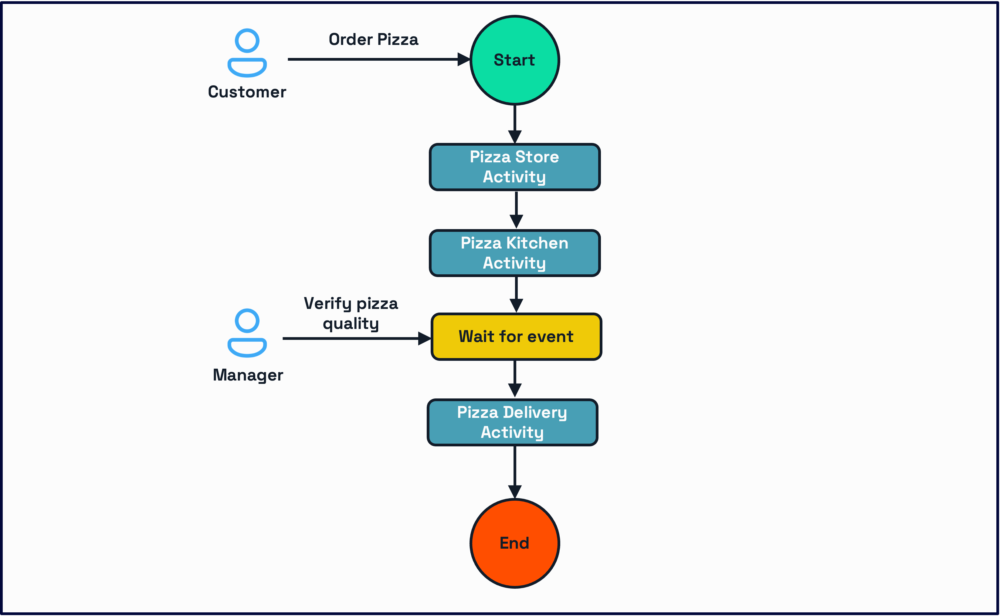

# Challenge 4 - Workflows

## Overview

On the fouth and final challenge, you will orchestrate the process of ordering, cooking, and delivering a pizza using Dapr Workflows. Dapr workflow makes it easy for developers to write business logic and integrations in a reliable way. Since Dapr workflows are stateful, they support long-running and fault-tolerant applications, ideal for orchestrating microservices.

You will:

- Replace the current chained service invocation calls that you created in the `pizza-storefront` service with a Workflow process.
- Add an external event to validate the quality of the pizza after the cooking proces is done.
- Query for the workflow status, pause, resume, and cancel the run.



To learn more about the Workflow building block, refer to the [Dapr docs](https://docs.dapr.io/developing-applications/building-blocks/workflow/).

## Import the required libraries

Navigate to the root folder of your project and run the command below in a terminal:

```bash
# Create virtual environment
python3 -m venv env
source env/bin/activate

cd pizza-workflow
pip install -r requirements.txt
```

## Modify the state store component to accept workflows

The Workflow building block requires a state store to manage its state during the run. You need to modify our `/resources/statestore.yaml` component to reflect that:

```yaml
apiVersion: dapr.io/v1alpha1
kind: Component
metadata:
  name: pizzastatestore
spec:
  type: state.redis
  version: v1
  metadata:
  - name: redisHost
    value: localhost:6379
  - name: redisPassword
    value: ""
  - name: actorStateStore
    value: "true"
scopes:
- pizza-workflow
- pizza-order
```

By setting the attribute `actorStateStore` value to `true` this state store component is able to manage Workflow data, since Workflows rely on [Dapr Actors](https://docs.dapr.io/developing-applications/building-blocks/workflow/workflow-features-concepts/#workflow-backend) in the background. You are also scoping the component to allow the `pizza-workflow` service to access it.

## Creating the Activities

Workflow activities are the basic unit of work in a workflow and are the tasks that get orchestrated in the business process. In this challenge, you will create a workflow to process a pizza order. The tasks will involve:

- Making a request to start the pizza order to the Storefront service.
- Invoking the Kitchen service to cook the pizza.
- Validating the pizza quality after it is cooked.
- Invoking the Delivery service to deliver the pizza.

Each task will be a separate activity. These activities will be executed in sequence since the order is imporant. Other [workflow patterns](https://docs.dapr.io/developing-applications/building-blocks/workflow/workflow-patterns/) can be used with Dapr Workflow, where activities are executed in parallel, or activities are called in a loop, but these are not relevant for this challenge.

Create a new file called `pizza_activities.py` inside the `pizza-workflow` directory. Add the following lines of code to the top to import the required libraries - Dapr Client and Dapr Workflow - and create the logger:

```python
from dapr.ext.workflow import WorkflowActivityContext
from dapr.clients import DaprClient
import json
import logging
import requests
from typing import Dict, Any

logger = logging.getLogger(__name__)
```

### Create the Storefront, Kitchen, and Deliver activities.

1. Create the Storefront activity by including the lines of code below:

```python
def order_pizza(ctx: WorkflowActivityContext, input_: Dict[str, Any]) -> Dict[str, Any]:
    """Activity to place pizza order via pizza-storefront service"""
    logger.info(f"Calling pizza-storefront service for order {input_['order_id']}")
   
    # Call the pizza-storefront service to order the pizza
    app_id = 'pizza-storefront'
    headers = {'dapr-app-id': app_id, 'content-type': 'application/json'}

    base_url = 'http://localhost'
    dapr_http_port = 3505
    method = 'order'
    target_url = '%s:%s/%s' % (base_url, dapr_http_port, method)

    response = requests.post(
        url=target_url,
        data=json.dumps(input_),
        headers=headers
    )

    return json.loads(response.content)
```

The `order_pizza` method has a `WorkflowActivityContext` and a generic input and output. In this case, you will input and output `order` objects. The service then uses the service invocation building block (challenge 2) to call the `/order` endpoint from the `pizza-storefront` service.

2. Add the Kitchen activity:

```python
def cook_pizza(ctx: WorkflowActivityContext, input_: Dict[str, Any]) -> Dict[str, Any]:
    """Activity to cook pizza via pizza-kitchen service"""
    logger.info(f"Calling pizza-kitchen service for order {input_['order_id']}")
    
    # Call the pizza-kitchen service to  the pizza
    app_id = 'pizza-kitchen'
    headers = {'dapr-app-id': app_id, 'content-type': 'application/json'}

    base_url = 'http://localhost'
    dapr_http_port = 3505
    method = 'cook'
    target_url = '%s:%s/%s' % (base_url, dapr_http_port, method)

    response = requests.post(
        url=target_url,
        data=json.dumps(input_),
        headers=headers
    )

    return json.loads(response.content)
```

3. Finnaly, add the Delivery activity:

```python
def deliver_pizza(ctx: WorkflowActivityContext, input_: Dict[str, Any]) -> Dict[str, Any]:
    """Activity to deliver pizza via pizza-delivery service"""
    logger.info(f"Calling pizza-delivery service for order {input_['order_id']}")
    
    # Call the pizza-delivery service to  the pizza
    app_id = 'pizza-delivery'
    headers = {'dapr-app-id': app_id, 'content-type': 'application/json'}

    base_url = 'http://localhost'
    dapr_http_port = 3505
    method = 'deliver'
    target_url = '%s:%s/%s' % (base_url, dapr_http_port, method)

    response = requests.post(
        url=target_url,
        data=json.dumps(input_),
        headers=headers
    )
    print('result: ' + response.text, flush=True)
    return json.loads(response.content)
```

### Create the Validation Activity

The Validation Activity is a little different from the activities above. It will act as an external event that will allow or deny moving forward with the Workflow itself.

Create a new method called `validate_pizza`. Copy and paste the following content:

```python
def validate_pizza(ctx: WorkflowActivityContext, input_: Dict[str, Any]) -> Dict[str, Any]:
  """Activity to handle pizza validation"""
  logger.info(f"Starting validation process for order {input_['order_id']}")
  # Store validation request in state store
  with DaprClient() as client:
      client.save_state(
          store_name="pizzastatestore",
          key=f"validation_{input_['order_id']}",
          value=json.dumps({
              "order_id": input_['order_id'],
              "status": "pending_validation"
          })
      )
  return input_
```

As you can see, the code below saves a `pending_validation` status to our state store. This will define if the order should move to the delivery process or not as our workflow will wait for an external event to determine its destiny.

```python
client.save_state(
    store_name="pizzastatestore",
    key=f"validation_{input_['order_id']}",
    value=json.dumps({
        "order_id": input_['order_id'],
        "status": "pending_validation"
    })
)
```

## Creating the Workflow

Now let's move to the Workflow itself. The Dapr Workflow engine will take care of scheduling and execution of the order tasks, including managing failures and retries.

Create a new file called `pizza_workflow.py` inside the `pizza-workflow` folder. Populate with the code below:

```python
from dapr.ext.workflow import DaprWorkflowContext
from typing import Dict, Any
import logging

from pizza_activities import order_pizza, cook_pizza, deliver_pizza

logger = logging.getLogger(__name__)

def pizza_workflow(context: DaprWorkflowContext, order_data: Dict[str, Any]):
    """Orchestrate the pizza order process"""
    try:
        logger.info(f"Starting workflow for order {order_data['order_id']}")
        
        # Step 1: Place and process the order
        logger.info(f"Placing order {order_data['order_id']}")
        order_result = yield context.call_activity(  
            order_pizza,  
            input=order_data
        )
        
        if order_result.get('status') != 'confirmed':
            raise Exception(f"Order failed: {order_result.get('error', 'Unknown error')}")
        
        # Step 2: Cook the pizza
        logger.info(f"Starting cooking for order {order_data['order_id']}")
        cooking_result = yield context.call_activity(  
            cook_pizza,  
            input=order_result
        )
        
        if cooking_result.get('status') != 'cooked':
            raise Exception(f"Cooking failed: {cooking_result.get('error', 'Unknown error')}")
        
        # Step 3: Wait for manager validation
        logger.info(f"Waiting for manager validation of order {order_data['order_id']}")
        validation_event = yield context.wait_for_external_event("ValidationComplete")  
        
        if not validation_event.get('approved'):
            raise Exception("Pizza validation failed - need to remake")
        
        # Step 4: Deliver the pizza
        logger.info(f"Starting delivery for order {order_data['order_id']}")
        delivery_result = yield context.call_activity(  
            deliver_pizza,  
            input=cooking_result
        )
        
        if delivery_result.get('status') != 'delivered':
            raise Exception(f"Delivery failed: {delivery_result.get('error', 'Unknown error')}")
        
        return {
            "order_id": order_data["order_id"],
            "status": "completed",
            "final_status": "delivered",
            "delivery_result": delivery_result
        }
        
    except Exception as e:
        logger.error(f"Workflow failed for order {order_data['order_id']}: {str(e)}")
        return {
            "order_id": order_data["order_id"],
            "status": "failed",
            "error": str(e)
        }
```

#### Let's break this down

1. `pizza_workflow` has a context of type `DaprWorkflowContext`. It receives a generic Dict as an attribute. In this case, we will provide an `order` object:

```python
def pizza_workflow(context: DaprWorkflowContext, order_data: Dict[str, Any]):
```

2. Every Activity is called using `context.call_activity` passing the Activity name and the order as an attribute. Also, every Activity call has a validation at the end, that determines if the step was successfully completed or not:

```python
order_result = yield context.call_activity(  
    order_pizza,  
    input=order_data
)

if order_result.get('status') != 'confirmed':
    raise Exception(f"Order failed: {order_result.get('error', 'Unknown error')}")
```

The process above applies for the `Storefront`, `Cooking`, and `Delivery` activities.

3. Now we call the `Validation` activity setting the current status of the result to `pending_validation`. This will prevent the workflow from moving forward until it receives an external event `ValidationComplete`.

```python
validation_event = yield context.wait_for_external_event("ValidationComplete")  
        
if not validation_event.get('approved'):
    raise Exception("Pizza validation failed - need to remake")
```

4. Finally, if anything fails, a `failed` status and an error message are attached to the order and it is returned.

```python
except Exception as e:
    logger.error(f"Workflow failed for order {order_data['order_id']}: {str(e)}")
    return {
        "order_id": order_data["order_id"],
        "status": "failed",
        "error": str(e)
    }
```

## Creating the controller

In this section, you will create endpoints to manage the workflow status. Open the file `app.py`.

### Import the DaprClient, WorkflowRuntime, and the activites/workflow you created in the steps above

Add the following import lines:

```python
from dapr.clients import DaprClient
from dapr.ext.workflow import WorkflowRuntime
from pizza_activities import order_pizza, cook_pizza, validate_pizza, deliver_pizza
from pizza_workflow import pizza_workflow
```

### Modify the endpoints to include the workflow actions

1. Inside the `start_order` endpoint, replace the `TODO:` comment with the code below:

```python
with DaprClient() as client:
  result = client.start_workflow(
      workflow_component="dapr",
      workflow_name="pizza_workflow",
      instance_id=instance_id,
      input=order_data
  )
```

We are using the Dapr Client to call `start_workflow` passing:

- A workflow component: `dapr`
- The name of the workflow we are invoking: `pizza_workflow`
- An input: the `order_data` object
- An instance id: the workflow Id that we will use to manage its lifecycle.

2. Inside the `validate_pizza` endpoint, replace the `TODO:` comment with the code below:

```python
with DaprClient() as client:
  client.raise_workflow_event(
    workflow_component="dapr",
    instance_id=f"pizza-order-{order_id}",
    event_name="ValidationComplete",
    event_data=validation_data
  )
```

We are using the Dapr Client to call `raise_workflow_event` passing:

- An instance id: the id that that was created when we started the workflow.
- A workflow component: `dapr`
- An event name `ValidationComplete` that will allow us to unblock the workflow.
- The event data: a `validation_data` object containing the validation_status that can be either `approved` or `rejected`. This attribute wil determine if the workflow should continue or stop.

3. Inside the `get_order` endpoint, replace the `TODO:` comment with the code below:

```python
with DaprClient() as client:
  result = client.get_workflow(
      workflow_component="dapr",
      instance_id=instance_id
  )
```

`get_workflow` returns the current status of the workflow.

4. Inside the `pause_order` endpoint, replace the `TODO:` comment with the code below:

```python
with DaprClient() as client:
  client.pause_workflow(
      workflow_component="dapr",
      instance_id=instance_id
  )
```

`pause_workflow` pauses the workflow after the current Activity completes its actions.

5. Inside the `resume_order` endpoint, replace the `TODO:` comment with the code below:

```python
with DaprClient() as client:
  client.resume_workflow(
      workflow_component="dapr",
      instance_id=instance_id
  )
```

`resume_workflow` resumes the paused workflow.

6. Inside the `cancel_order` endpoint, replace the `TODO:` comment with the code below:

```python
with DaprClient() as client:
  client.terminate_workflow(
      workflow_component="dapr",
      instance_id=instance_id
  )
```

`terminate_workflow` terminates the workflow after the current Activity completes its actions.

### Register the Workflow and Activities

Finnaly, you will register the workflow and its activities when the service starts. Replace the `TODO: Register workflow and activities` comment with the code below:

```python
def run_workflow_runtime():
    logger.info("Initializing workflow runtime")
    workflow_runtime = WorkflowRuntime()
    
    # Register workflow and activities
    workflow_runtime.register_workflow(pizza_workflow)
    workflow_runtime.register_activity(order_pizza)
    workflow_runtime.register_activity(cook_pizza)
    workflow_runtime.register_activity(validate_pizza)
    workflow_runtime.register_activity(deliver_pizza)
    
    logger.info("Starting workflow runtime")
    workflow_runtime.start()
```

### Start the workflow runtime

Replace `TODO: Start workflow runtime in a separate thread` with the code below to start the workflow runtime in a separate thread:

```python
workflow_thread = threading.Thread(target=run_workflow_runtime, daemon=True)
workflow_thread.start()
```

## Remove the service invocation calls from the Storefront service

Inside the `pizza-storefront` folder, navigate to `app.py`. Remove the following lines from `process_order`:

```python
# Call the pizza-kitchen service to cook the pizza
app_id = 'pizza-kitchen'
headers = {'dapr-app-id': app_id, 'content-type': 'application/json'}

base_url = 'http://localhost'
dapr_http_port = 3502
method = 'cook'
target_url = '%s:%s/%s' % (base_url, dapr_http_port, method)

response = requests.post(
    url=target_url,
    data=json.dumps(order_data),
    headers=headers
)
print('result: ' + response.text, flush=True)

# Call the pizza-delivery service to deliver the pizza
app_id = 'pizza-delivery'
headers = {'dapr-app-id': app_id, 'content-type': 'application/json'}

method = 'deliver'
target_url = '%s:%s/%s' % (base_url, dapr_http_port, method)

response = requests.post(
    url=target_url,
    data=json.dumps(order_data),
    headers=headers
)
print('result: ' + response.text, flush=True)
```

Now that the workflow is responsible for orchestrating the service invocation calls more elegantly, you don't need the same behaviour happening in the Storefront service.

## Run the application

It's time to run all five applications. If the `pizza-storefront`, `pizza-kitchen`, `pizza-delivery`, and the `pizza-store`
services are still running, press **CTRL+C** in each terminal window to stop them.

1. Open a new terminal window, navigate to the `/PizzaOrder` folder and run the command below:

```bash
dapr run --app-id pizza-order --app-protocol http --app-port 8001 --dapr-http-port 3501 --resources-path ../resources -- python3 app.py
```

2. In a new terminal, navigate to the `/pizza-storefront` folder and run the command below:

```bash
dapr run --app-id pizza-storefront --app-protocol http --app-port 8002 --dapr-http-port 3502 --resources-path ../resources -- python3 app.py
```

3. Open a new terminal window and navigate to `/pizza-kitchen` folder. Run the command below:

```bash
dapr run --app-id pizza-kitchen --app-protocol http --app-port 8003 --dapr-http-port 3503 --resources-path ../resources -- python3 app.py
```

4. Open a fourth terminal window and navigate to `/pizza-delivery` folder. Run the command below:

```bash
dapr run --app-id pizza-delivery --app-protocol http --app-port 8004 --dapr-http-port 3504 --resources-path ../resources -- python3 app.py
```

5. Open a fifth terminal window and navigate to `/pizza-workflow` folder. Run the command below:

```bash
dapr run --app-id pizza-workflow --app-protocol http --app-port 8005 --dapr-http-port 3505 --resources-path ../resources -- python3 app.py
```

> [!IMPORTANT]
> If you are using Consul as a naming resolution service, add `--config ../resources/config/config.yaml` before `-- dotnet run` on your Dapr run command.

## Test the service

### Use VS Code REST Client

Open `Endpoints.http` and start a new workflow sending the request on `Start a new pizza order workflow`.

Navigate to the `pizza-workflow` terminal, where you should see the following logs pop up with all the events being updated:

```bash
== APP == 2024-12-05 23:48:49,766 - werkzeug - INFO - 127.0.0.1 - - [05/Dec/2024 23:48:49] "POST /start-order HTTP/1.1" 200 -
== APP == 2024-12-05 23:48:49,767 - pizza_workflow - INFO - Starting workflow for order 123
== APP == 2024-12-05 23:48:49,767 - pizza_workflow - INFO - Placing order 123
== APP == 2024-12-05 23:48:49.767 durabletask-worker INFO: pizza-order-123: Orchestrator yielded with 1 task(s) and 0 event(s) outstanding.
== APP == 2024-12-05 23:48:49,773 - pizza_activities - INFO - Calling pizza-storefront service for order 123
== APP == 2024-12-05 23:48:53,860 - pizza_workflow - INFO - Starting workflow for order 123
== APP == 2024-12-05 23:48:53,860 - pizza_workflow - INFO - Placing order 123
== APP == 2024-12-05 23:48:53,861 - pizza_workflow - INFO - Starting cooking for order 123
== APP == 2024-12-05 23:48:53.861 durabletask-worker INFO: pizza-order-123: Orchestrator yielded with 1 task(s) and 0 event(s) outstanding.
== APP == 2024-12-05 23:48:53,867 - pizza_activities - INFO - Calling pizza-kitchen service for order 123
== APP == 2024-12-05 23:49:06,946 - pizza_workflow - INFO - Starting workflow for order 123
== APP == 2024-12-05 23:49:06,946 - pizza_workflow - INFO - Placing order 123
== APP == 2024-12-05 23:49:06,946 - pizza_workflow - INFO - Starting cooking for order 123
== APP == 2024-12-05 23:49:06,946 - pizza_workflow - INFO - Waiting for manager validation of order 123
== APP == 2024-12-05 23:49:06.947 durabletask-worker INFO: pizza-order-123: Orchestrator yielded with 0 task(s) and 1 event(s) outstanding.
```

Once the validation stage arrives, send a request under `Validate pizza (approve)` to move the workflow forward. You shopuld see the logs being updated:

```bash
== APP == 2024-12-05 23:51:25.659 durabletask-worker INFO: pizza-order-123 Event raised: validationcomplete
== APP == 2024-12-05 23:51:25,659 - pizza_workflow - INFO - Starting delivery for order 123
== APP == 2024-12-05 23:51:25.659 durabletask-worker INFO: pizza-order-123: Orchestrator yielded with 1 task(s) and 0 event(s) outstanding.
== APP == 2024-12-05 23:51:25,661 - werkzeug - INFO - 127.0.0.1 - - [05/Dec/2024 23:51:25] "POST /validate-pizza HTTP/1.1" 200 -
== APP == 2024-12-05 23:51:25,665 - pizza_activities - INFO - Calling pizza-delivery service for order 123
== APP == result: {"customer":{"address":"123 Main St","name":"John Doe","phone":"555-0123"},"order_id":"123","pizza_type":"pepperoni","size":"large","status":"delivered"}
== APP == 
== APP == 2024-12-05 23:51:38,765 - pizza_workflow - INFO - Starting workflow for order 123
== APP == 2024-12-05 23:51:38,765 - pizza_workflow - INFO - Placing order 123
== APP == 2024-12-05 23:51:38,765 - pizza_workflow - INFO - Starting cooking for order 123
== APP == 2024-12-05 23:51:38,765 - pizza_workflow - INFO - Waiting for manager validation of order 123
== APP == 2024-12-05 23:51:38,766 - pizza_workflow - INFO - Starting delivery for order 123
== APP == 2024-12-05 23:51:38.766 durabletask-worker INFO: pizza-order-123: Orchestration completed with status: COMPLETED
INFO[0042] pizza-order-123: 'pizza_workflow' completed with a COMPLETED status.  app_id=pizza-workflow instance=diagrid.local scope=wfengine.durabletask.backend type=log ver=1.14.4
INFO[0042] Workflow Actor 'pizza-order-123': workflow completed with status 'ORCHESTRATION_STATUS_COMPLETED' workflowName 'pizza_workflow'  app_id=pizza-workflow instance=diagrid.local scope=dapr.wfengine.backend.actors type=log ver=1.14.4
```

## Dapr multi-app run

Open the multi-run app file `dapr.yaml` and include the workflow service to it:

```yaml
version: 1
common:
  resourcesPath: ./resources
  # Uncomment the following line if you are running Consul for service naming resolution
  # configFilePath: ./resources/config/config.yaml
apps:
  - appDirPath: ./pizza-order/
    appID: pizza-order
    appPort: 8001
    daprHTTPPort: 3501
    command: ["python3", "app.py"]
  - appDirPath: ./pizza-storefront/
    appID: pizza-storefront
    daprHTTPPort: 3502
    appPort: 8002
    command: ["python3", "app.py"]
  - appDirPath: ./pizza-kitchen/
    appID: pizza-kitchen
    appPort: 8003
    daprHTTPPort: 3503
    command: ["python3", "app.py"]
  - appDirPath: ./pizza-delivery/
    appID: pizza-delivery
    appPort: 8004
    daprHTTPPort: 3504
    command: ["python3", "app.py"]
  - appDirPath: ./pizza-workflow/
    appID: pizza-workflow
    appPort: 8005
    daprHTTPPort: 3505
    command: ["python3", "app.py"]
```

Stop the services, if they are running, and enter the following command in the terminal:

```bash
dapr run -f .
```

All five services will run at the same time and log events at the same terminal window.

## Next steps

Congratulations, you have completed all the challenges and you can claim your [reward](../completion.md)!
