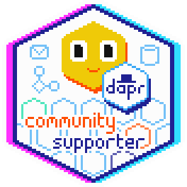

# Challenges completed

Thank you for completing the Diagrid Dapr Workshop!

If you have more questions or comments about Dapr, please join the [Dapr Discord](https://bit.ly/dapr-discord), where hundreds of developers are sharing their experiences.

## Claim your reward

You can now claim the [Dapr Supporter badge](https://bit.ly/dapr-supporter).

*This requires a GitHub account to log into [Holopin.io](https://www.holopin.io/@dapr)*

Once you've claimed your badge, please share it on your LinkedIn profile and and tag #Dapr, we'll mention you in an upcoming [Dapr Community Call live stream](https://www.youtube.com/@daprdev/streams)!

## More resources

- [Dapr website](https://dapr.io)
- [Dapr documentation](https://docs.dapr.io/)
- [Diagrid website](https://diagrid.io)
