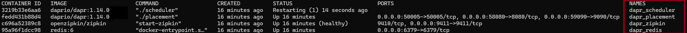

# Prerequisites

## Dependencies

Download and install the following locally:

- [Docker](https://docs.docker.com/engine/install/)
- [Visual Studio Code](https://code.visualstudio.com/download)
- [Dev Containers - Optional but recommended](https://marketplace.visualstudio.com/items?itemName=ms-vscode-remote.remote-containers)

If you use the [devcontainer](https://containers.dev/) configuration for the .NET or Python workshop challenges, you don't need anything else, since everything is already part of the devcontainer. Continue to the [Considerations](#considerations) section.

If you're **not** using the devcontainer option you will also need to install:

- [REST Client for VS Code](https://marketplace.visualstudio.com/items?itemName=humao.rest-client)
- [Database Client for VSCode](https://marketplace.visualstudio.com/items?itemName=cweijan.vscode-database-client2) or [Redis Insight](https://redis.io/insight/) (optional to visualize Redis data)
- [Powershell](https://learn.microsoft.com/en-us/powershell/scripting/install/installing-powershell-on-windows?view=powershell-7.4) (for Windows users)

Today the workshop is offered in two languages, Python and Java. For the language of your choice you will also need to install the following:

<details>
<summary>Python</summary>

- [Python 3](https://www.python.org/downloads/)
- [Python Extension for Visual Studio Code](https://marketplace.visualstudio.com/items?itemName=ms-python.python)

</details>
<details>
<summary>.NET</summary>

- [dotnet 8.0](https://dotnet.microsoft.com/download/dotnet/8.0)
- [C# Extension for Visual Studio Code](https://marketplace.visualstudio.com/items?itemName=ms-dotnettools.csharp)

</details>

## Dapr Installation

1. Follow [these steps](https://docs.dapr.io/getting-started/install-dapr-cli/) to install the Dapr CLI.

2. [Initialize Dapr](https://docs.dapr.io/getting-started/install-dapr-cli/):

```bash
dapr init
```

3. Verify if local Dapr containers are running:

```bash
docker ps
```



## Considerations

### Integrated terminal

It is recommended to use Visual Studio Code to run the workshop. You will use the integrated terminal in VS Code extensively. All terminal commands have been tested on a Apple M3 Pro, and on a Windows 11 laptop using DevContainers.

### Prevent port collisions

During the workshop you will run the services in the solution on your local machine. To prevent port-collisions, all services listen on a different HTTP port. When running the services with Dapr, you need additional ports for HTTP and gRPC communication with the sidecars. If you follow the Dapr CLI instructions, the services will use the following ports for their Dapr sidecars to prevent port collisions:

| Service                    | Application port | Dapr sidecar HTTP port  |
|----------------------------|------------------|------------------------|
| pizza-store      | 8001             | 3501                   |
| pizza-kitchen      | 8002             | 3502                  |
| pizza-delivery | 8003             | 3503               |

If you're on Windows with Hyper-V enabled, you might run into an issue that you're not able to use one (or more) of these ports. This could have something to do with aggressive port reservations by Hyper-V. You can check whether or not this is the case by executing this command:

```powershell
netsh int ipv4 show excludedportrange protocol=tcp
```

If you see one (or more) of the ports shown as reserved in the output, fix it by executing the following commands in an administrative terminal:

```powershell
dism.exe /Online /Disable-Feature:Microsoft-Hyper-V
netsh int ipv4 add excludedportrange protocol=tcp startport=8001 numberofports=3
netsh int ipv4 add excludedportrange protocol=tcp startport=3501 numberofports=3
dism.exe /Online /Enable-Feature:Microsoft-Hyper-V /All
```

### Running self-hosted on MacOS with VPN/Firewalls enabled

Some antivirus software blocks mDNS (we've actually encountered this with Sophos). mDNS is used for name-resolution by Dapr when running locally in self-hosted mode. Blocking mDNS will cause issues with service invocation. If you encounter any errors when invoking services using service invocation, use HashiCorp Consul as an alternative name resolution service.

Run the following command line to initialize Consul:

```bash
docker run -d -p 8500:8500 -p 8600:8600/udp --name dtc-consul consul:1.15 agent -dev -client '0.0.0.0'
```

Then, when you finish all challenges, run:

```bash
docker rm dtc-consul -f
```

You can verify whether Consul is used for name-resolution by searching for the occurrence of the following line in the Dapr sidecar logging:

```bash
ℹ️  Starting Dapr with id pizza-kitchen. HTTP Port: 3502.
...
INFO[0000] Initialized name resolution to consul ...
...
```

## Getting started

Initialize your environment in your language of choice.

<details>
  
<summary>Python</summary>

In your terminal, run:

```bash
git clone https://github.com/diagrid-labs/dapr-workshop-python.git
cd dapr-workshop-python
```

Open the `dapr-workshop-python` folder in VSCode. If you want to use the Python devcontainer, select _Open in Container_ when VSCode shows this message.

If you're not using the devcontainer, install `virtualenv` first:

```bash
pip install virtualenv
```

Initialize the virtual environment on your local machine or in the devcontainer:

```bash
python -m venv env
source env/bin/activate
```

</details>

<details>
  
<summary>.NET</summary>

In your terminal, run:

```bash
git clone https://github.com/diagrid-labs/dapr-workshop-csharp.git
cd dapr-worksop-csharp
```

Open the `dapr-workshop-csharp` folder in VSCode. If you want to use the .NET devcontainer, select _Open in Container_ when VSCode shows this message.

</details>

You are now ready to begin the first challenge! Choose your path below:

- [Python](/docs/challenge-1/python.md)
- [C#/.NET](/docs/challenge-1/dotnet.md)
